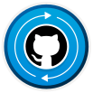

# Certificates

🔗 **Verification:**
[Microsoft Learn Profile](https://learn.microsoft.com/en-us/users/yossk-1196/achievements)

---

| Achievement                    | Status   | Completed     | Badge                                                                |
| ------------------------------ | -------- | ------------- | -------------------------------------------------------------------- |
| GitHub Foundations Part 1 of 2 | ✅ Passed | June 10, 2026 |  |
| GitHub Foundations Part 2 of 2 | ✅ Passed | June 17, 2026 |  |

---

## Skills Learned

### Part 1

* Git fundamentals
* Repositories
* Branches
* Commits
* Pull Requests
* GitHub Flow

### Part 2

* Collaboration
* Issues
* Discussions
* GitHub Projects
* Security fundamentals
* Team workflows
